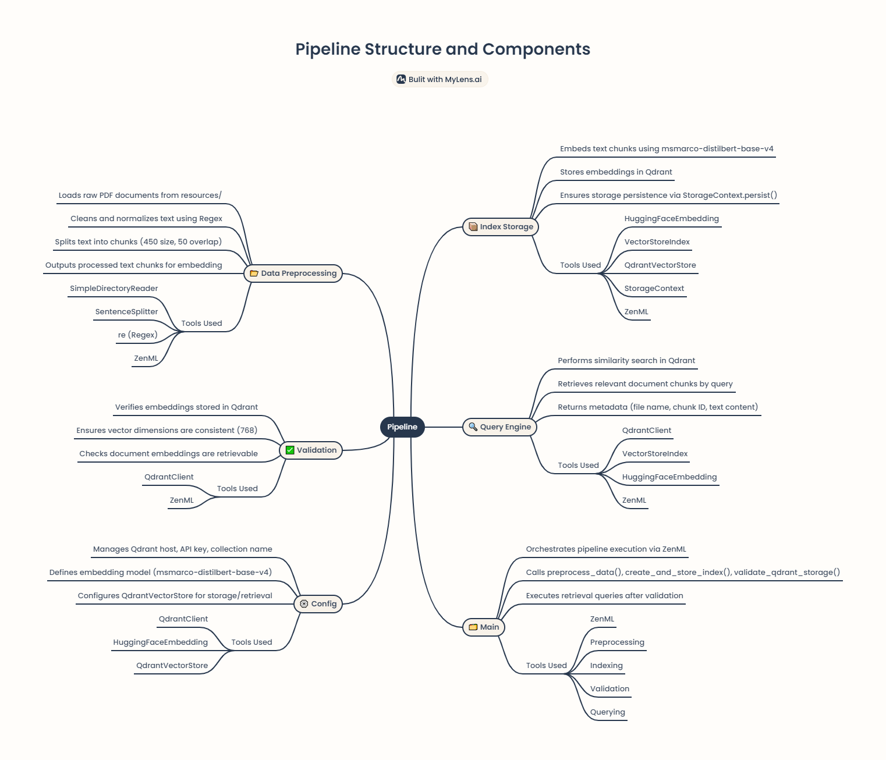
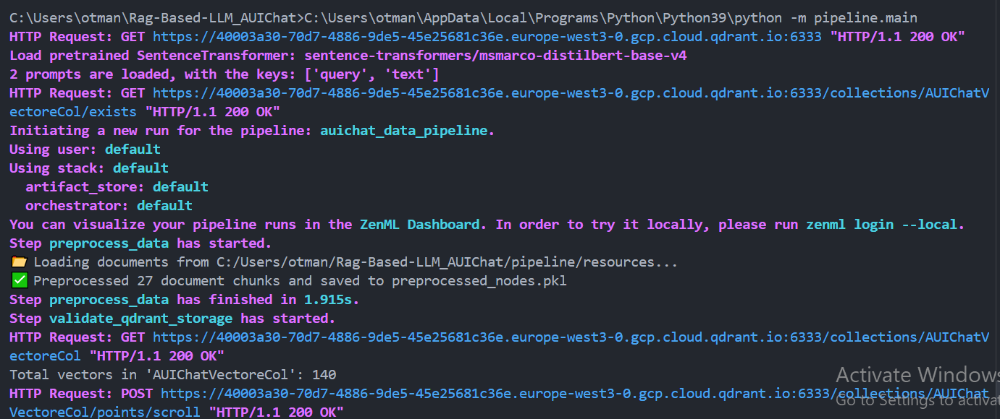
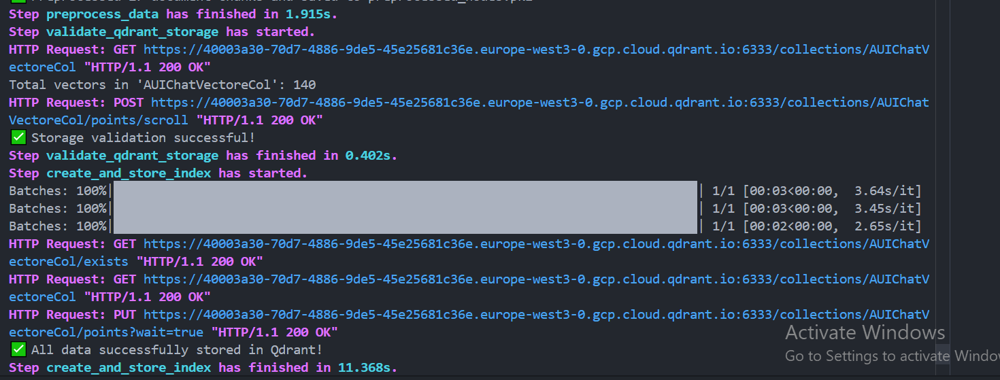

# **ML Pipeline Development - Milestone 3 Report**

check notebooks for clear outputs for:
 * ingestion of raw data and storage into a repository
 * Data preprocessing and feature engineering
 * Data validation/verification 

## **1. Introduction**

This report outlines the progress made in **Milestone 3: Data Acquisition and Preparation** as part of the larger **ML Pipeline Development** for AUIChat, a RAG-based chatbot. This milestone involved structuring the data pipeline, implementing data validation, preprocessing, embedding generation, and storage. Additionally, the pipeline was integrated into ZenML to enhance reproducibility and scalability.

## **2. Ensuring ML Pipeline Reproducibilit** 

### ✅ **2.1 Project Structure Definition and Modulari**

- **Where?** The project was modularized into separate components under the `pipeline/` directory:
  - `Data_preprocessing.py` → Data loading, cleaning, chunking
  - `index_storage.py` → Embedding generation & vector storage
  - `query_engine.py` → Query processing and retrieval
  - `validation.py` → Data validation
  - `config.py` → Centralized configurations
  - `main.py` → Pipeline execution

### ✅ **2.2 Code Versioning** 

- **Where?** Git was used for version control.
- **How?** Commits were structured for each milestone.

### ✅ **2.3 Data Versioning** 

- **Where?** Implemented using **DVC (Data Version Control)**.
- **How?**
  - Dataset stored under `pipeline/resources/`
  - Tracked using DVC to allow reproducible dataset versions.
  - Issue with Git tracking (`git rm --cached pipeline/resources` resolved).

### ✅ **2.4 Experiment Tracking and Model Versioning** 

- **Where?**
  - **ZenML** tracks pipeline execution.
  - **MLflow** (optional) for additional logging and model versioning.

### ✅ **2.5 Setting Up a Meta Store for Metadata**

- **Where?**
  - **Qdrant** stores metadata (file names, chunk IDs, timestamps, versions).
  - **ZenML** tracks metadata at each pipeline step.

### ✅ **2.6 Setting Up the ML Pipeline Under an MLOps Platform** 

- **Where?** Integrated with **ZenML** to orchestrate data processing, indexing, and querying.
- **How?**
  - `@pipeline` decorator in `main.py`.
  - Steps (`@step`) in `Data_preprocessing.py`, `index_storage.py`, `query_engine.py`, `validation.py`.

---

## **3. Pipeline Components** 

### ✅ **3.1 Setup of Data Pipeline Within the ML Pipeline / MLOps Platform**

#### ✅ **3.1.1 Data Validation and Verification** 

- **Where?** Implemented in `validation.py`.
- **How?**
  - Checks Qdrant storage integrity.
  - Validates embedding existence & metadata consistency.
  - Uses `validate_qdrant_storage()`.

#### ✅ **3.1.2 Preprocessing and Feature Engineering** 

- **Where?** Implemented in `Data_preprocessing.py`.
- **How?**
  - **Cleaning**: Converts text to lowercase, removes special characters.
  - **Chunking**: Uses `SentenceSplitter` (chunk size = 450, overlap = 50).
  - **Feature Store Integration**: Qdrant stores preprocessed embeddings.
-

### ❌ **3.2 Integration of Model Training and Offline Evaluation into the ML Pipeline / MLOps Platform** 

- **Where?** Not applicable in this milestone since **AUIChat uses retrieval-based methods instead of model training.**
- **Future Work:** Model fine-tuning for ranking retrieved documents.

### ✅ **3.3 Development of Model Behavioral Tests** 

- **Where?** Implemented in `validation.py`.
- **How?**
  - Retrieval consistency tests.
  - Ensures Qdrant stores valid embeddings & metadata.

---

## **4. Summary of Achievements**

 **Fully modular pipeline setup under ZenML.** **Data ingestion, validation, and storage completed.**  **Qdrant used as a vector store + metadata store.**  **Data versioning with DVC.**  **Experiment tracking via ZenML.**  **Retrieval pipeline structured for fast response times.**

##

### 📚 References & Additional Resources

Below is a curated list of resources that were instrumental in shaping this milestone. These materials include **guides, research papers, documentation, and video tutorials** related to **Retrieval-Augmented Generation (RAG), vector databases, and feature engineering**.

#### 🔹 Articles & Blogs
- [**Vector Databases for Efficient Data Retrieval in RAG**](https://medium.com/@genuine.opinion/vector-databases-for-efficient-data-retrieval-in-rag-a-comprehensive-guide-dcfcbfb3aa5d) – Comprehensive guide on using vector databases in RAG.  
- [**Feature Engineering & Supervised LLM Fine-Tuning for RAG**](https://ibrahim-olawale13.medium.com/feature-engineering-and-supervised-llm-fine-tuning-for-rag-inferences-part-2-3a1645d66ebb) – Explores feature engineering techniques for improving RAG performance.  

#### 🔹 Research Papers
- [**MemoRAG: Moving Towards Next-Gen RAG via Memory-Inspired Knowledge Discovery**](https://www.researchgate.net/publication/383912324_MemoRAG_Moving_towards_Next-Gen_RAG_Via_Memory-Inspired_Knowledge_Discovery) – Investigates memory-based retrieval methods for enhancing RAG.  
- [**MemoRAG GitHub Repository**](https://github.com/qhjqhj00/MemoRAG) – Implementation of MemoRAG concepts in an open-source project.  

#### 🔹 Official Documentation
- [**Qdrant Documentation**](https://qdrant.tech/documentation) – In-depth reference on how Qdrant works as a vector database.  
- [**LlamaIndex Integration with Hugging Face**](https://llamahub.ai/l/llms/llama-index-llms-huggingface?from=) – Guide on using **LlamaIndex with Hugging Face** for LLM-powered RAG applications.  

#### 🔹 Video Tutorials & Walkthroughs
- **YouTube Guides on RAG & Vector Databases:**  
  - [**Understanding RAG and Its Applications**](https://youtu.be/mHrwS6ZoNKc?si=Lctcvy_D7V_CbxdD)  
  - [**How Vector Databases Work**](https://youtu.be/3UsluX0jryM?si=gMdeeQhyJCh3mkGx)  
  - [**Implementing RAG with LlamaIndex**](https://youtu.be/JEBDfGqrAUA?si=GtnHyxE6AuJH0g0b)  

