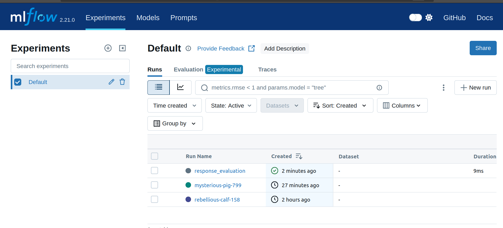
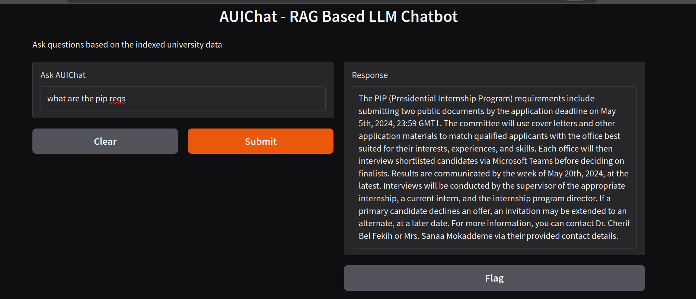
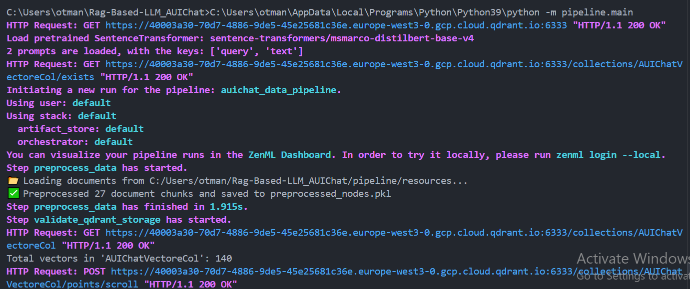
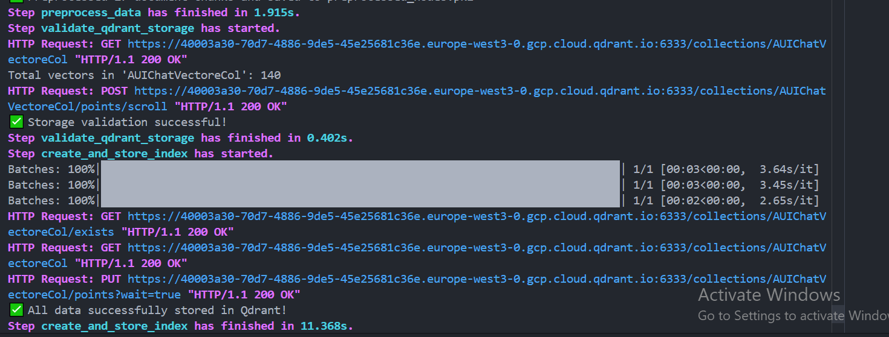

# **ML Pipeline Development - Milestone 3 Report**

Check notebooks for clear outputs for:

- Ingestion of raw data and storage into a repository
- Data preprocessing and feature engineering
- Data validation/verification

## **1. Introduction**

This report outlines the progress made in **Milestone 3: Data Acquisition and Preparation** as part of the larger **ML Pipeline Development** for AUIChat, a RAG-based chatbot. This milestone involved structuring the data pipeline, implementing data validation, preprocessing, embedding generation, and storage. Additionally, the pipeline was integrated into ZenML to enhance reproducibility and scalability.

## **2. Ensuring ML Pipeline Reproducibility**

### ✅ **2.1 Project Structure Definition and Modularity**

- **Where?** The project follows a modular layout using the Cookiecutter data science template:

```bash
rag_based_llm_auichat/
├── data/            # Raw, processed, external, interim datasets
├── demo/            # UI and assets for demonstrations
├── docs/            # Documentation and references
├── models/          # Saved or trained models
├── notebooks/       # Experiments and EDA notebooks
├── references/      # Static files like PDFs
├── reports/         # Generated figures and plots
└── src/             # Actual pipeline source code
    ├── data/            # Preprocessing and storage
    ├── features/        # Feature store & engineering
    ├── models/          # Model interfaces (LLM)
    ├── valisation/      # Validation logic
    └── workflows/       # Main pipeline and orchestration
```

### ✅ **2.2 Code Versioning**

- **Where?** GitHub and Git used for managing all version control.
- **How?**
  - Feature branches like `query-ui` created for UI integration
  - `.gitignore` handles large files (e.g. `venv/`, `.DS_Store`, `.ipynb_checkpoints/`)

### ✅ **2.3 Data Versioning**

- **Where?** Using **DVC** to version raw and processed data.
- **How?**
  - Raw PDFs stored under `data/raw/`
  - Tracked with `.dvc` files, ensuring reproducibility

### ✅ **2.4 Experiment Tracking and Model Versioning**

- **Where?** Integrated into ZenML and **MLflow**
- **How?**
  - Every experiment step (e.g., embedding choice, chunk size, LLM config) is logged to MLflow.
  - Tracked using `mlflow.start_run()` within ZenML `@step` decorators.
  - Metrics: Semantic similarity, response length, etc.

### ✅ **2.5 Setting Up a Meta Store for Metadata**

- **Where?**
  - Qdrant stores vectorized chunks + metadata.
  - ZenML tracks pipeline metadata (artifacts, runs, steps).

### ✅ **2.6 Setting Up the ML Pipeline Under an MLOps Platform**

- **Where?** ZenML orchestrates the full pipeline.
- **How?**
  - Steps defined using `@step` in ZenML.
  - End-to-end workflow in `pipeline/main.py`.
  - Pipeline runs visualized in ZenML dashboard.

---

## **3. Pipeline Components**


### ✅ **3.1 Setup of Data Pipeline Within the ML Pipeline / MLOps Platform**

#### ✅ **3.1.1 Data Validation and Verification**

- **Where?** Implemented in `valisation/validation.py`
- **How?**
  - Uses Qdrant's `scroll()` to confirm embeddings and payloads
  - Checks for missing vectors or metadata issues

#### ✅ **3.1.2 Preprocessing and Feature Engineering**

- **Where?** `data/Data_preprocessing.py`
- **How?**
  - Cleaning, chunking, metadata tagging
  - Embedding generation using `HuggingFaceEmbedding`
  - Saved locally and/or pushed to Qdrant

### ❌ **3.2 Integration of Model Training and Offline Evaluation into the ML Pipeline / MLOps Platform**

- **Where?** No model training (retrieval-focused pipeline)
- **Future Work:** Ranking models / Fine-tuning / Hybrid RAG

### ✅ **3.3 Development of Model Behavioral Tests**

- **Where?** `valisation/validation.py`
- **How?**
  - Validation step ensures retrieval outputs valid results
  - Also used to test new sources before indexing

---

## **4. Experimentation and Evaluation (Milestone 4)**


### ✅ **4.1 Embedding Model and Chunking Strategy Evaluation**

- **Where?** `notebooks/experiments.ipynb`
- **How?**
  - Runs combinations of embedding models (e.g., `all-MiniLM`, `msmarco-distilbert`)
  - Tests different chunk sizes and overlap values
  - Evaluation via `evaluate_response()` step

### ✅ **4.2 Evaluation Step with ZenML & MLflow**

- **Step:** `evaluate_response(query, llm_response, ground_truth)`
- **Logs to MLflow:**
  - `semantic_similarity`
  - Query text
  - Ground truth presence
- **Why:** Allows experiment tracking over time

### ✅ **4.3 Interactive UI (RAG Gradio Frontend)**


- **Where?** `demo/gradio_app.py`
- **How?**
  - Uses Gradio to launch a chatbot interface for testing live queries
  - Integrated as a step inside the ZenML pipeline (via `launch_gradio_app()`)

---

## **5. Summary of Achievements**

**📌 Modular ZenML pipeline**  |  **📌 Experiment tracking with MLflow**  |  **📌 RAG architecture powered by Qdrant**\
**📌 Feature store integrated (feast)** | **📌 Gradio chatbot UI** | **📌 Chunking, embedding, and LLM evaluation experiments**


##




### 📚 References & Additional Resources

Below is a curated list of resources that were instrumental in shaping this milestone. These materials include **guides, research papers, documentation, and video tutorials** related to **Retrieval-Augmented Generation (RAG), vector databases, and feature engineering**.

#### 🔹 Articles & Blogs
- [**Vector Databases for Efficient Data Retrieval in RAG**](https://medium.com/@genuine.opinion/vector-databases-for-efficient-data-retrieval-in-rag-a-comprehensive-guide-dcfcbfb3aa5d) – Comprehensive guide on using vector databases in RAG.  
- [**Feature Engineering & Supervised LLM Fine-Tuning for RAG**](https://ibrahim-olawale13.medium.com/feature-engineering-and-supervised-llm-fine-tuning-for-rag-inferences-part-2-3a1645d66ebb) – Explores feature engineering techniques for improving RAG performance.  

#### 🔹 Research Papers
- [**MemoRAG: Moving Towards Next-Gen RAG via Memory-Inspired Knowledge Discovery**](https://www.researchgate.net/publication/383912324_MemoRAG_Moving_towards_Next-Gen_RAG_Via_Memory-Inspired_Knowledge_Discovery) – Investigates memory-based retrieval methods for enhancing RAG.  
- [**MemoRAG GitHub Repository**](https://github.com/qhjqhj00/MemoRAG) – Implementation of MemoRAG concepts in an open-source project.  

#### 🔹 Official Documentation
- [**Qdrant Documentation**](https://qdrant.tech/documentation) – In-depth reference on how Qdrant works as a vector database.  
- [**LlamaIndex Integration with Hugging Face**](https://llamahub.ai/l/llms/llama-index-llms-huggingface?from=) – Guide on using **LlamaIndex with Hugging Face** for LLM-powered RAG applications.  

#### 🔹 Video Tutorials & Walkthroughs
- **YouTube Guides on RAG & Vector Databases:**  
  - [**Understanding RAG and Its Applications**](https://youtu.be/mHrwS6ZoNKc?si=Lctcvy_D7V_CbxdD)  
  - [**How Vector Databases Work**](https://youtu.be/3UsluX0jryM?si=gMdeeQhyJCh3mkGx)  
  - [**Implementing RAG with LlamaIndex**](https://youtu.be/JEBDfGqrAUA?si=GtnHyxE6AuJH0g0b)  

