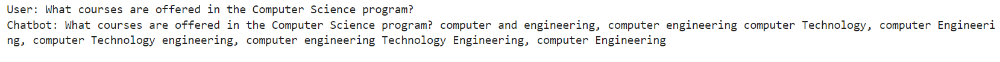
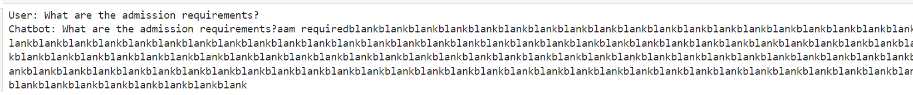
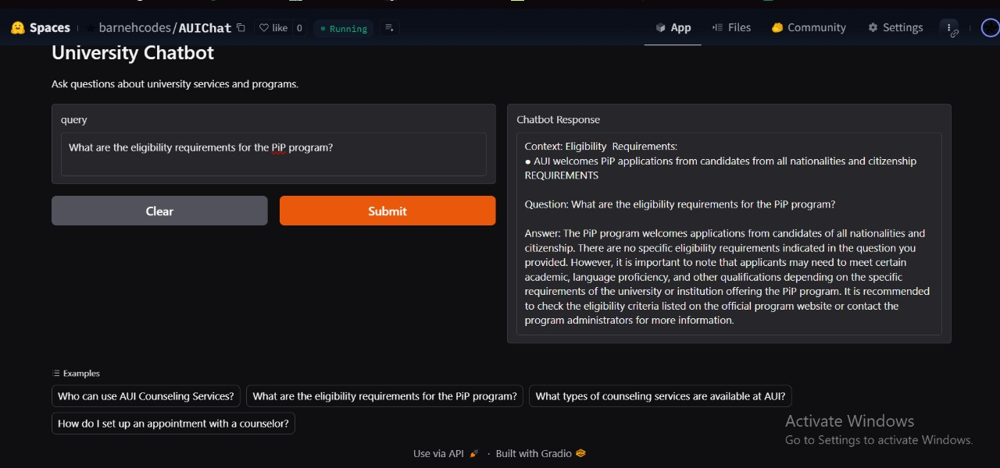
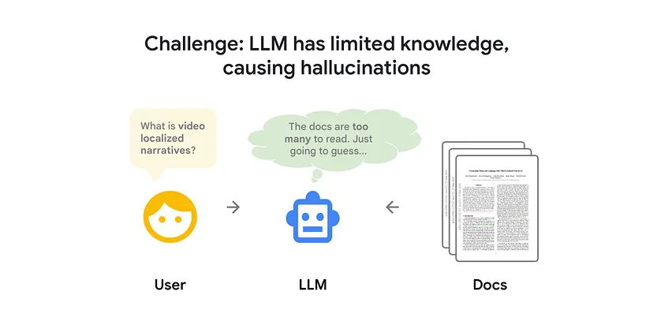
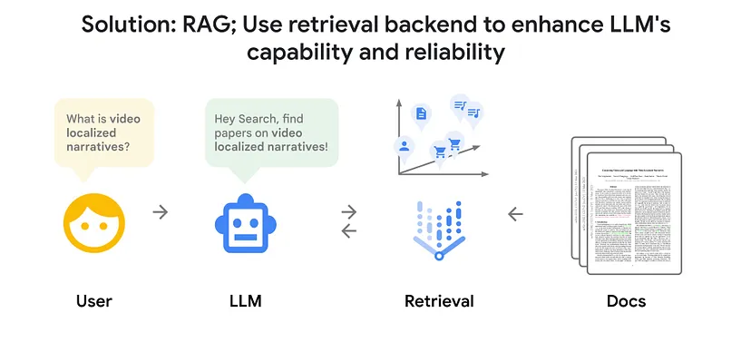
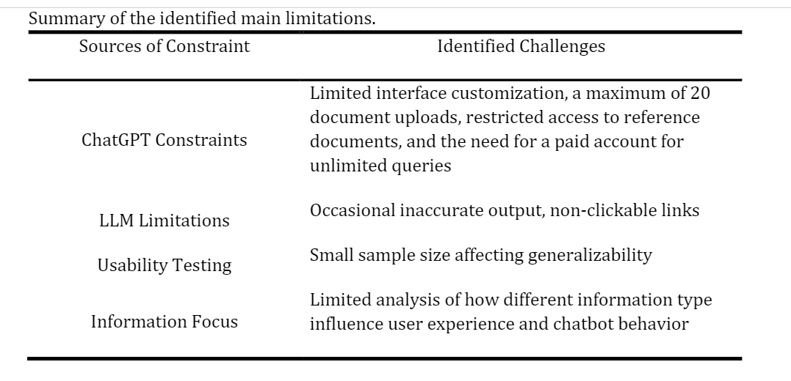
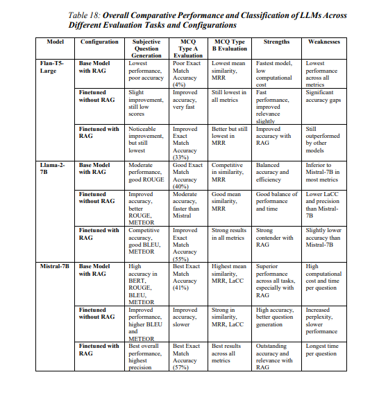
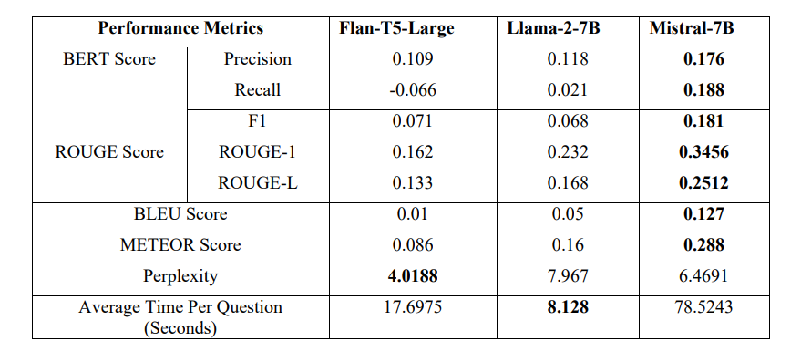
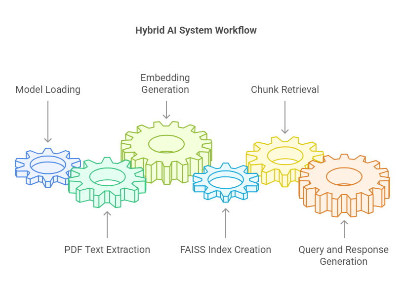

| **Name** | Otmane El Bekkaoui |
| --- | --- |
| **ID** | 86039 |
| Space Link | https://huggingface.co/spaces/barnehcodes/AUIChat |
| **Objective** | **Milestone 1: Project inception** |

## Introduction

Our previous attempt to implement this project introduced many constraints and roadblocks, highlighting the limitations of stand-alone LLMs and their error-prone and hallucination-prone outcomes. With the knowledge we have gathered, we will leverage RAG capabilities to reduce these inconveniences to an acceptable level and document how we progressed from this:





result of hallucination (fine-tuning)

To This :



### Feasibility Study

[How to build a simple RAG LLM Chatbot](https://medium.com/@turna.fardousi/how-to-build-a-simple-rag-llm-chatbot-47f3fcec8c85)





Lets discuss the feasibility of this new version of the project.

**Data Availability and Curation**

This issue has become less significant with the integration of RAG, as fine-tuning requires an immense amount of data and preprocessing. In contrast, a RAG system can function well with reasonably gathered resources. Additionally, the availability of FAQ documents, catalogs, student handbooks, etc., is high—one simple Google search can provide access to authentic data.

The risk of bias still exists, as more students are likely to inquire about topics like housing than the summer session. Naturally, this results in more resources on the former. However, we propose a solution:

- Since most inquiries are "general knowledge" (e.g., GPA, CGPA, exchange policies)—information common across universities—we can gather external data and modify it to meet the specific needs of AUI.

**Cost and Resource Constraints**

We decided to switch to using the inference API, as loading performant models locally would be costly.

This approach also imposes a limit on the size of the knowledge base—more documents increase the complexity of the retrieval operation.

**Adoption and Effectiveness**

Thanks to the RAG-based approach, we can ensure the model will not hallucinate responses or mislead users. This reliability increases confidence in the system, making it more likely for the university to adopt it as a primary layer of communication between students and administration.

### **Related Works**

In addition to the resources from our previous attempt, we recognize the following papers and articles as key inspirations for our RAG-based approach. We will summarize our learnings from them.

Unimib :



**LLM Intelligent Agent Tutoring Brașov, Romania**

- **Dependency on Data Quality**: The chatbot's accuracy relies on the quality and completeness of curated academic sources. Any gaps or biases in these sources may affect the responses.
- **Need for Extensive Testing**: While initial results are promising, broader testing across various subjects and educational contexts is required to fully validate its effectiveness.
- **Planned Evaluation**: The system will be tested with students in the **Virtual Instrumentation** course at **Transilvania University of Brașov** during the next academic year.

## Methodology

### 1. model of choice : Mistral-7B-Instruct-v0.3

Why?



https://www.researchgate.net/publication/385167532_Comparative_Analysis_of_Retrieval-Augmented_Generation_RAG_based_Large_Language_Models_LLM_for_Medical_Chatbot_Applications

**Key Points:**

- **Superior Performance Across All Tasks**:
    - Mistral-7B consistently delivers the highest accuracy and precision across subjective question generation, MCQ Type A (Exact Match Accuracy), and MCQ Type B (similarity and MRR).
    - Fine-tuned with RAG, it achieves the **best Exact Match Accuracy (57%)**, the highest among all models.
- **Outstanding RAG Integration**:
    - When fine-tuned with RAG, Mistral-7B shows **the best results across all metrics**, offering the most accurate and contextually relevant responses.
    - It excels in both **accuracy** and **relevance**, making it ideal for complex information retrieval tasks.

**Model metrics :**



https://www.researchgate.net/publication/385167532_Comparative_Analysis_of_Retrieval-Augmented_Generation_RAG_based_Large_Language_Models_LLM_for_Medical_Chatbot_Applications

**Mistral-7B** is chosen over other models because it delivers the **highest accuracy and text quality** across all key metrics (BERT, ROUGE, BLEU, METEOR). It excels in **precision, recall, and fluency**, making it ideal for tasks requiring **detailed and accurate responses**. Although it has a **longer processing time**, its **superior performance** and **better output quality** justify the trade-off.

Plus :  Mistral-7B-Instruct-v0.3 ****HuggingFace provides an inference api, thus minimizing the resource needed.

### 2. dataset or “knowledge base”

sources were relatively easy to find,  since its public information but only one source was found that is in the FAQ form,  which is the favored format, others like catalog, handbooks … needed extra preprocessing.

so far the model only runs on two PDFs for testing purposes.

### 3. implementation

**1. Model Loading (Runs on Hugging Face's Servers)**

- **Model:** `mistralai/Mistral-7B-Instruct-v0.3`
- **API Usage:**
    - The large language model is **not loaded locally** (avoiding high computational costs).

**2. PDF Text Extraction (Runs Locally)**

- **Function:** `extract_text_from_pdf()`
    - Extracts text from local PDF files using `PyPDF2`.
    - Runs locally on the user's machine.
    
    ```python
    pip_requirements_text = extract_text_from_pdf("PiP 24-25 Program Requirements.pdf")
    counseling_faq_text = extract_text_from_pdf("Counseling Services FAQ Spring 2024.pdf")
    ```
    

**3. Embedding Generation & FAISS Index (Runs Locally)**

- **Sentence Embedding:**
    - Uses the `all-MiniLM-L6-v2` model from the `sentence-transformers` package.
- **FAISS Index:**
    - A **local** FAISS index is created for fast similarity search using **L2 distance**.

**4. Chunk Retrieval (Runs Locally)**

- **Function:** `retrieve_relevant_chunks()`
    - When the user asks a question, the system encodes it, searches the FAISS index, and retrieves the **top-k** most relevant chunks locally.

**5. Query and Response Generation (Hybrid: Local + Hugging Face Servers)**

- **Locally:**
    - The context is retrieved and combined with the user’s question.
    - Context length is **truncated** for better performance.
- **Hugging Face API:**
    - The combined input is sent to **Hugging Face** for **Mistral-7B** to generate a response.



sources : 

- https://huggingface.co/blog/airabbitX/rag-vs-fine-tuning-for-llms-a-com
- https://huggingface.co/collections/Skeptomai/llm-for-rag-6578a49123b2859ba2571d84
- https://huggingface.co/mistralai/Mixtral-8x7B-Instruct-v0.1
- [https://huggingface.co/mistralai/Mixtral-8x7B-Instruct-v0.](https://huggingface.co/mistralai/Mixtral-8x7B-Instruct-v0.1)3
- https://huggingface.co/blog/not-lain/rag-chatbot-using-llama3
- https://www.youtube.com/watch?v=01_2-Dy57ys

Papers/article:

- https://www.researchgate.net/publication/382133060_LLM_Intelligent_Agent_Tutoring_in_Higher_Education_Courses_using_a_RAG_Approach
- https://medium.com/@turna.fardousi/how-to-build-a-simple-rag-llm-chatbot-47f3fcec8c85
- https://www.researchgate.net/publication/386335312_Unimib_Assistant_designing_a_student-friendly_RAG-based_chatbot_for_all_their_needs
- https://www.researchgate.net/publication/385167532_Comparative_Analysis_of_Retrieval-Augmented_Generation_RAG_based_Large_Language_Models_LLM_for_Medical_Chatbot_Applications